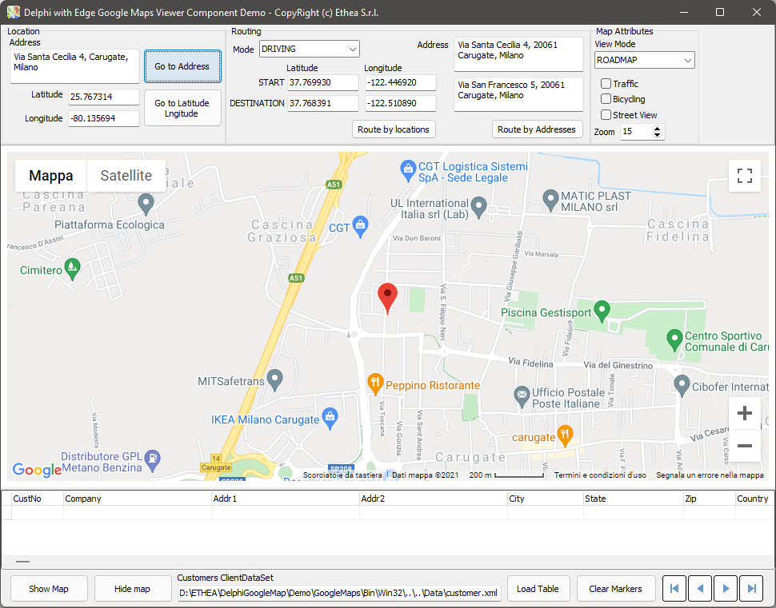
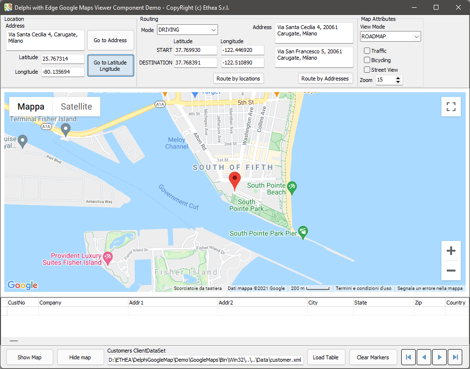
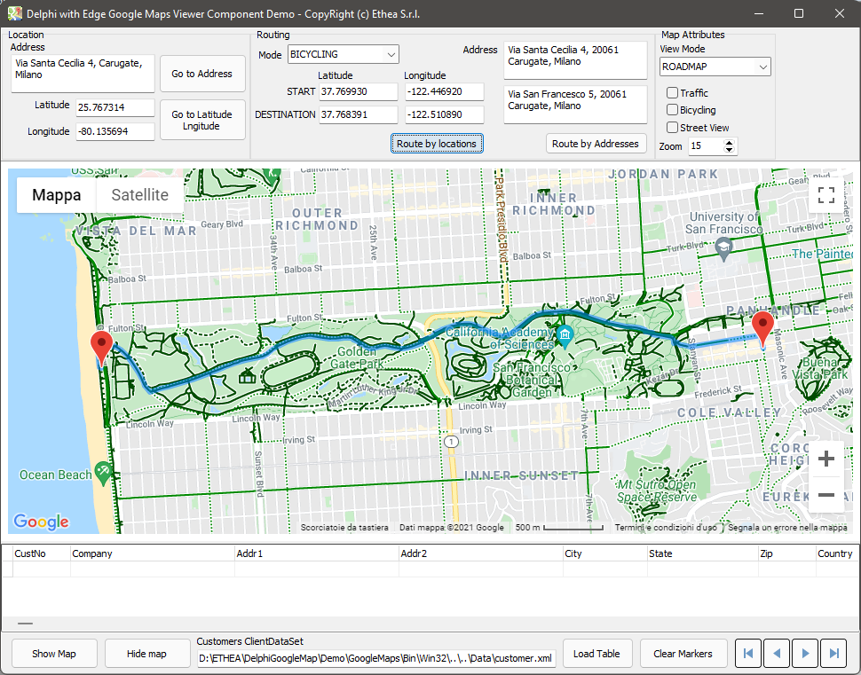
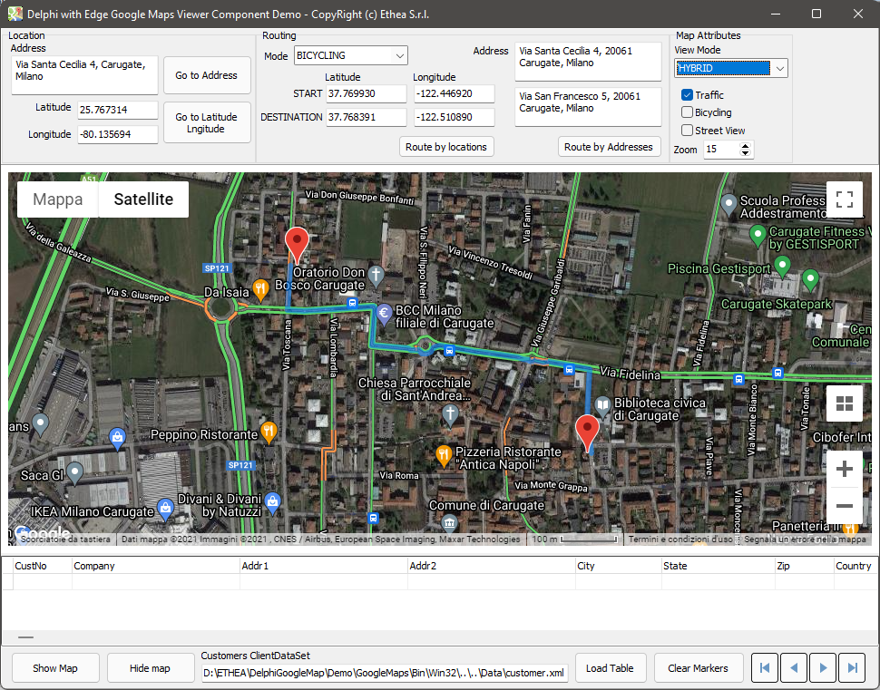
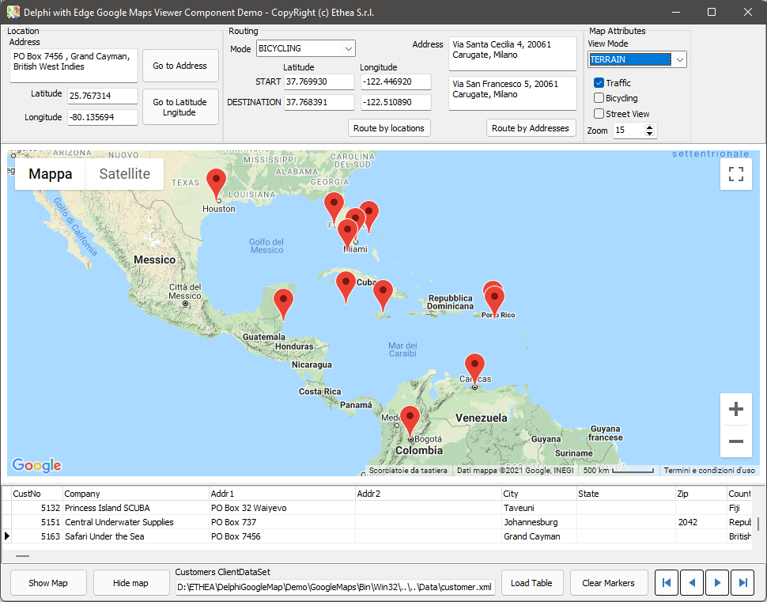

# DelphiGoogleMap  [](https://opensource.org/licenses/Apache-2.0)

Delphi Edge Component to View Google Map with Routing and Markers Support

### Actual official version 1.3.0 (VCL)

This component is based on [TEdgeBrowser Component](https://docwiki.embarcadero.com/RADStudio/Sydney/en/Using_TEdgeBrowser_Component_and_Changes_to_the_TWebBrowser_Component) (available from Delphi 10.4)

It's very easy to use Google Maps API directly from Delphi Code, settings Component properties or invoking methods, for example:

```pascal
//Goto Address Example
EdgeGoogleMapViewer.GotoAddress(MemoAddress.Lines.Text);

//Goto Latitude/Longitude Example
var
  Location: TLatLng;
begin
  Location.Latitude := TEdgeGoogleMapViewer.TextToCoord(Latitude.Text);
  Location.Longitude := TEdgeGoogleMapViewer.TextToCoord(Longitude.Text);
  EdgeGoogleMapViewer.GotoLocation(Location);
  
//Setting Map View Mode
  EdgeGoogleMapViewer.MapTypeId := TGoogleMapTypeId(MapTypeIdComboBox.ItemIndex);
  
```
## A complete demo is available!

Notice that in the same folder of the executable you must place the correct webview2loader.dll (32 or 64 bit) as you can see into Demo\GoogleMaps\Bin\Win32 and Demo\GoogleMaps\Bin\Win64.

### Available from Delphi 10.4.2 to Latest (32bit and 64bit platforms)


Related links: https://www.embarcadero.com/ - https://learndelphi.org/

## INSTALLATION

Open \Packages\DelphiGoogleMap.dproj from Delphi 10.4 or Delphi 11.0: Build and Install Component TEdgeGoogleMapViewer.

# The Demo in action

Open \Demo\GoogleMaps\GoogleMapsTest.dproj: Build (32 or 64 bit) and Run.

**Notice: you need a Google API key to activate the navigation**: by default the Demo request to input API before using the component, or you can edit TformMain.EdgeGoogleMapViewerBeforeShowMap event to add your API KEY to the component.

### Goto Address (Via S.Cecilia 4, Carugate, Milano )

Input Address and click to "Goto Address":



### Goto Latitude/Longitude (25.767314 / -80.135694)

Input Latutude and Longitude and click to "Goto Latitude/Longitude"



### Route Bicycling - RoadMap View Style

Select Routing Mode "Bicycling", Select "RoadMap" View Mode, click to "Route by Location":



### Route By Address - Hybrid and Traffic from Satellite View Style

Select Select "Hybrid" View Mode, Activate Traffic and click to "Route by Addreess":



### Markers from Customer Table (customers.xml)

Load Customer Table, scroll down the table: for every record a Marker is added to the Map. Zoom out map to see all Markers.



### DOCUMENTATION

No documentation available, but the Demo explain very well the use of the component.

### RELEASE NOTES
09 Apr 2022:
- Version 1.3.0
- Fixed problem building package for Delphi 10.4.2

07 Dec 2021:
- Version 1.2.0
- Change base object to TCustomEdgeBrowser
- inherit properies to allow the hiding of OnWebMessageReceived and presenting new event OnWebUnhandledMessageReceived
- Map onclick, onzoom listener events
- New property OnMapClick and OnMapRightClick
- Demo to show right click menu and adding a marker
- Demo to have option on center on mouse click
- Demo updated to change zoom edit value on map zoom event
- GotoLocation changed to have option to place marker.

02 Nov 2021:
- Version 1.1.0
- Added method to register UserDataFolder: TEdgeGoogleMapViewer.RegisterUserDataFolder
- Added Event Handler BeforeInitMap
- Added a secondary form to Demo (to test multiple instance of component)

24 Sep 2021:
- Version 1.0.0
- Google Map Viewer Component based on TEdgeBrowser
- Full Demo available
